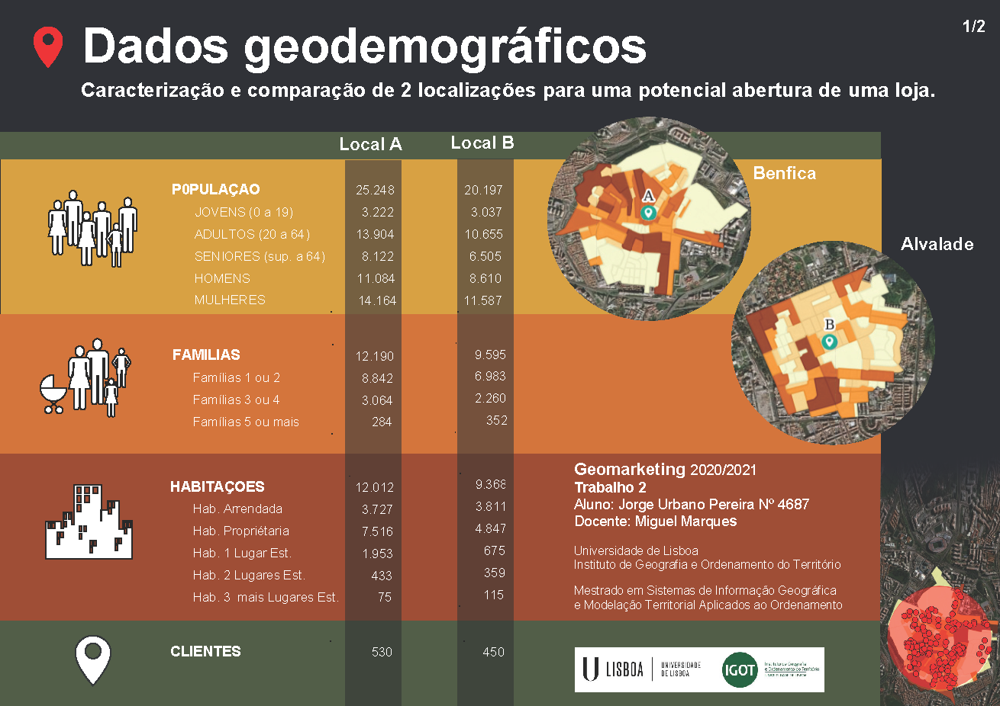

# Dados Geodemográficos
Unidade curricular - <B>Geomarketing</B> 2020/21 
Mestrado em Sistemas de Informação Geográfica e Modelação Territorial Aplicados ao Ordenamento 
IGOT - Instituto de Geografia e Ordenamento do Território 
UL - Universidade de Lisboa 
https://norge0.github.io/geomarketing/

